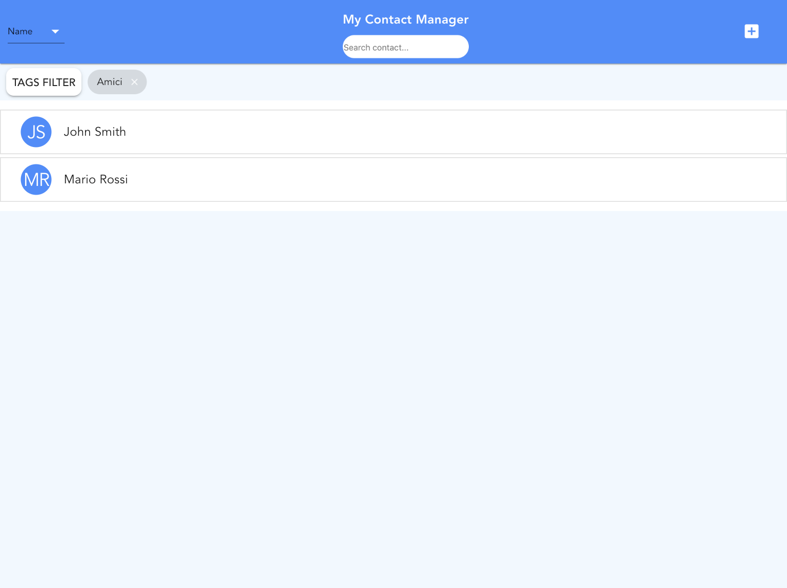
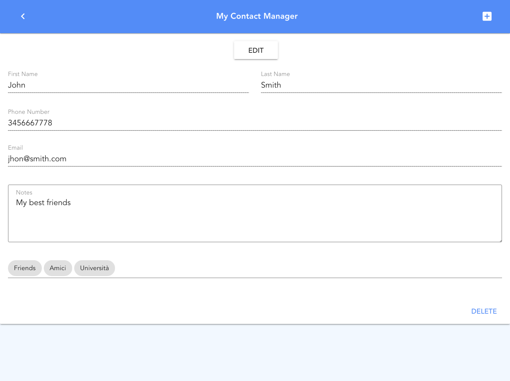

# Vue-ContactManager
It's a simple Web contact manager developed for a class assignement of the Human Computer Interaction course at University of Florence. The implementation was made using Vue.js and Material Desing. The data of the contact manager are persisted using the localStorage.

  


## Functionalities
The contact manager allows to:
* Visualize the entire list of contacts
* Order the list of contacts
* Visualize a single contact
* Delete a contact from the single contact visualization
* Insert a new contact
* Persist the contact list across multiple invocation
* Associate tags to a contact and filter contact visualization by tag
* Edit a contact
* Search a term in the contact fields filtering the contact visualization
* Asynchronously edit the contact list from multiple instances the GUI. Active GUIs dynamically update whenever changes are made.


## Project setup and Run
```
npm install
npm run serve
```

### Compiles and hot-reloads for development
```
npm run serve
```

### Compiles and minifies for production
```
npm run build
```
